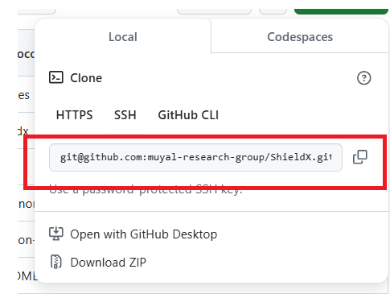

# ShieldX 

<div align="center">

</div>

<div align=center>
<a href="https://test.pypi.org/project/mictlanx/"></a>
</div>

ShieldX is a secure management platform for microservices. It provides an integrated dashboard and toolset to manage, monitor, and secure your microservices environment. With robust encryption, secure communication channels, and scalable orchestration, ShieldX is designed to safeguard your infrastructure while ensuring efficient operations.

## Getting started

You must install the following software: 

- [Docker](https://github.com/pyenv/pyenv?tab=readme-ov-file#linuxunix)
- Poetry
    ```bash
    pip3 install poetry
    ```
- [pyenv](https://github.com/pyenv/pyenv?tab=readme-ov-file#linuxunix)
    ```bash
    curl -fsSL https://pyenv.run | bash
    ```


Once you get all the software, please execute the following command to install the dependencies of the project: 

```bash
poetry install
```

## 🐳 Deploy with Docker

This section explains how to build, run, and stop the **ShieldX** service using Docker and Docker Compose.

---

### 1️⃣ Running directly from Docker Hub

Since the image `edgar821/shieldx-api:latest` is already published on Docker Hub, you can start the full stack (API and MongoDB) **without building anything locally**.

Simply run:

```bash
docker compose up -d
````

Docker Compose will:

* Download `edgar821/shieldx-api:latest` from Docker Hub.
* Download `mongo:latest` if not already present.
* Start all containers with the configuration in `docker-compose.yml`.

---

### 2️⃣ Build the image locally (optional)

If you want to build the image from the `Dockerfile` instead of pulling from Docker Hub:

```bash
docker build -t edgar821/shieldx-api:latest .
```

**Explanation of parameters:**

* `-t edgar821/shieldx-api:latest` → Sets the name and tag for the image.
* `.` → The build context (current directory).

Or with Docker Compose:

```bash
docker compose build
```

To rebuild without using the cache:

```bash
docker compose build --no-cache
```

---

### 3️⃣ Important Dockerfile parameters

* **Base Image:**
  `python:3.11-slim` → Lightweight Python image for faster builds and smaller final image size.

* **System Dependencies:**
  Installs packages needed for compiling Python libraries (e.g., `build-essential`, `libpq-dev`).

* **Poetry Setup:**
  Configures Poetry to install dependencies inside the project (`virtualenvs.in-project true`) and installs all dependencies from `pyproject.toml` and `poetry.lock`.

* **Application Code:**
  Copies the source code into the container and sets the working directory to `/app`.

* **Entry Command:**
  Starts the FastAPI server with Uvicorn.

---

### 4️⃣ Important docker-compose parameters

* **`image`**:
  Uses `edgar821/shieldx-api:latest` from Docker Hub (no local build required).

* **`ports`**:
  Maps container ports to the host. Example: `"20000:20000"` makes the API available at `http://localhost:20000`.

* **`depends_on`**:
  Ensures `shieldx-db` (MongoDB) start before `shieldx-api`.

* **`volumes`**:
  Mounts persistent storage for MongoDB data.

---

### 5️⃣ Start the services

```bash
docker compose up -d
```

`-d` runs containers in detached mode.

---

### 6️⃣ Stop and clean up

To stop:

```bash
docker compose down
```

To stop and remove all containers, networks, and volumes:

```bash
docker compose down -v
```

⚠️ **Warning:** The `-v` option deletes volumes, which means all MongoDB data will be lost.

---

### 7️⃣ Environment variables

`docker-compose.yml` can load variables from a `.env` file not committed to the repository for security reason, but an example is shown here:

```env
API_PORT=20000
MONGO_URI=mongodb://shieldx-db:27017
RABBITMQ_PORT=5672
RABBIT_MAQ_MANAGEMENT_PORT=15672
LOG_LEVEL=info
API_IMAGE=edgar821/shieldx-api:latest
```

You can document them here or in a `.env.example` without sensitive data.

---

### 8️⃣ Accessing and Running the Service

* **API endpoint:** [http://localhost:20000](http://localhost:20000)
* **API Docs (Swagger UI):** [http://localhost:20000/docs](http://localhost:20000/docs)

#### Running the FastAPI Server locally (development mode)


```bash
poetry run python3 ./shieldx/server.py
```

---

### 9️⃣ Automating Docker Image Build and Publication

Now that you can run ShieldX locally using Docker Compose, you can also automate the image build and publication process using scripts and GitHub Actions.

#### 🧱 Local Build (build.sh)

To build the image locally and deploy the full stack (API + MongoDB + RabbitMQ), simply run:

```bash
./build.sh [IMAGE_NAME] [IMAGE_TAG]
```

**Example:**

```bash
./build.sh shieldx api-0.0.1a0
```

This command will:

* Build the Docker image `edgar821/shieldx-api:0.0.1a0`
* Restart the stack using `docker-compose.yml`
* Display a custom ASCII banner during build

If no version is specified, `latest` will be used automatically.

---

#### 🚀 Automatic Publish via GitHub Actions

A dedicated GitHub Action automatically builds and pushes the Docker image to Docker Hub whenever a new tag is created.

**Workflow file:**

```
.github/workflows/docker-publish.yml
```

**Trigger condition:**

```yaml
on:
  push:
    tags:
      - "v*"
```

**How it works:**

1. When a tag is pushed (e.g. `v0.0.1a0`), the Action runs automatically.
2. It builds the image using the repository Dockerfile.
3. It logs in to Docker Hub using secrets.
4. It pushes the tagged image to the public registry.

**Example:**

```bash
git tag v0.0.1a0
git push origin v0.0.1a0
```

The resulting image will be available at:
👉 [https://hub.docker.com/r/edgar821/shieldx-api/tags](https://hub.docker.com/r/edgar821/shieldx-api/tags)

---

#### 🔐 GitHub Secrets Required

Set the following under
**Settings → Secrets and variables → Actions**

| Secret Name       | Description             | Example             |
| ----------------- | ----------------------- | ------------------- |
| `DOCKER_USERNAME` | Docker Hub username     | `edgar821`          |
| `DOCKER_TOKEN`    | Docker Hub access token | `ghp_xxxxxxxxxxxxx` |

> 🔹 Generate your token at *Docker Hub → Account Settings → Security → New Access Token* with **Read, Write, Delete** permissions.

---

#### 🧩 Optional Manual Publish (publish.sh)

You can also push manually using:

```bash
export DOCKER_USERNAME=edgar821
export DOCKER_TOKEN=<your_docker_hub_token>
./publish.sh [version]
```

**Example:**

```bash
./publish.sh 0.0.1a0
```

This will log in to Docker Hub, push the image, and log out automatically.

---

#### ✅ Quick Summary

| Action                   | Command                                        | Description                           |
| ------------------------ | ---------------------------------------------- | ------------------------------------- |
| 🧱 Build locally         | `./build.sh shieldx api-0.0.1a0`                           | Builds and runs the stack             |
| 🚀 Publish manually      | `./publish.sh 0.0.1a0`                         | Pushes the image to Docker Hub        |
| 🤖 Publish automatically | `git tag v0.0.1a0 && git push origin v0.0.1a0` | Triggers GitHub Action build and push |

---

📘 **In summary:**
The Docker Compose setup helps you run ShieldX locally, while the CI/CD workflow (`build.sh`, `publish.sh`, and GitHub Actions) ensures consistent and automatic publishing to Docker Hub for production releases.


---

## Running Tests

All tests for this project are located in the `tests/` folder at the root of the repository. We use [pytest](https://docs.pytest.org/) as our testing framework.

### How to Run the Tests

1. **Navigate to the project directory:**
   ```bash
   cd path/to/your/project

2. Run all tests:
    ```bash
    pytest
    ```
3. Run a specific test file: 
    ```bash
    pytest tests/test_policy_manager.py
    ```

## Contributing[](#contribution)

Please follow these steps to help improve the project:

1. **Fork the Repository:**
   - Click the "Fork" button at the top right of the repository page to create a copy under your GitHub account.

2. **Create a Feature Branch:**
   - Create a new branch from the `main` branch. Use a descriptive branch name (e.g., `feature/new-algorithm` or `bugfix/fix-issue`):
     ```bash
     git checkout -b feature/your-feature-name
     ```

3. **Make Your Changes:**
   - Implement your feature or fix the issue. Make sure to write or update tests located in the `tests/` folder as needed.

4. **Run the Tests:**
   - Verify that all tests pass by running:
     ```bash
     pytest
     ```
   - Ensure that your changes do not break any existing functionality.

5. **Commit and Push:**
   - Write clear and concise commit messages. Then push your branch to your fork:
     ```bash
     git push origin feature/your-feature-name
     ```

6. **Open a Pull Request:**
   - Navigate to the repository on GitHub and open a pull request against the `main` branch. Please include a detailed description of your changes and the motivation behind them.

7. **Review Process:**
   - Your pull request will be reviewed by the maintainers. Feedback and further changes may be requested.

## ⚠️ Clone the repo and setup a remote 🍴: 

1. You must clone the remote from the organization of Muyal: 
```bash
git clone git@github.com:muyal-research-group/ShieldX.git
```

2. You must create a fork (please check it up in the [Contribution](#contribution) section)

3. Add a new remote in your local git: 
   ```bash
   git remote add <remote_name> <ssh> 
   ```
You must select ```<remote_name>``` and you must copy the ```<ssh>``` uri in the github page of your 

<div align="center">

</div>

4. Remember to push all your commits to your ```<remote_name>``` to avoid github conflicts. 

Thats it!  let's get started 🚀